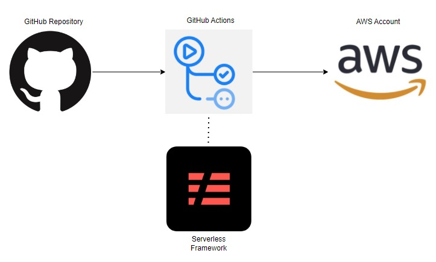
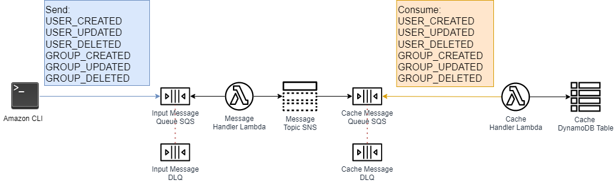

# Software Engineer Test Backend

The purpose of this repository is to solve the WatchGuard hiring challenge.  This Implementation is deployed on my AWS account and to accomplish that I've created a basic CD using the Serverless Framework and the GitHub actions as follow the diagram below:




## How it woks

The `serverless.yml` file  contains the definition of the AWS resources (e.g. functions, the events that trigger them, dynamo table, queues and topics) used in this solution. Find below the architecture diagram with all pieces:



1- The SQS insert commands are sent trough the AWS CLI to the **Input Message Queue** . These commands contain the USERS and the GROUPS.

```shell
aws sqs send-message --queue-url https://sqs.us-east-1.amazonaws.com/849681156123/software-engineer-test-backend-dev-inputMessageQueue --message-body file://<EventFile>.json --delay-seconds 1
```

All the event files referenced in the command above are in the directory `../doc/Input Events`

2- The messages are consumed by the lambda function **Message Handler**. This lambda will do some basic validation and <u>hash the password</u>.

```python
@staticmethod
def __hash_password(*, password: str) -> str:
    log.info('hashing password')
    byte_password = password.encode('utf-8')

    # Generate salt
    salt = uuid.uuid4().hex

    # Hash password
    password_hash_salt = hashlib.sha256(salt.encode() + byte_password).hexdigest() + ':' + salt
    #log.debug(f'byte_hash {password_hash_salt}')

    return password_hash_salt
```

3- The lambda **Message Handler** publishes the valid events on the SNS **Message Topic**.

4- The **Cache Message Queue** subscribes to the **Message Topic**.

5- The messages are consumed by the lambda function **Cache Handler**.

6-The lambda **Cache Handler** parse the raw messages form the **Cache Message Queue** and does writes/reads in the **Cache DynamoDB Table** .

If any error occurs during the events processing the message will be automatically sent to the DLQs

## Database Model

The DynamoDB was picked because it is serverless and billed by the usage (I'm using a free tier AWS account). 

To make things simple I've created two main entities GROUP and USER and a third one to represent the relation between them. This is not the best solution since dynamoDB is noSQL (see the Adjacency List Pattern in the assumption section).

USER model:

```json
{
   "partittionKey":"USER|uuid(email)",
   "sortKey":"USER",
   "name":"joazinho",
   "email":"abc@wow.com",
   "password":"xpto",
   "groups":[
      "111",
      "222"
   ]
}
```

GROUP model:

```json
{"partittionKey":"GROUP|uuid(name)",
   "sortKey":"GROUP",
    "name":"developers"
}
```

GROUP_MEMBER model

```json
{
   "partittionKey":"GROUP|uuid(name)",
   "sortKey":"GROUP_MEMBER|uuid(email)",
}
```


## Assumptions

Considering the time constraints and the scope of work I created some assumptions

1- You cannot delete a GROUP if there are USERS inside. *My comments: Its possible to be implemented however it demands time and better strategy to deal with DynamoDB (Adjacency List Pattern)* https://docs.aws.amazon.com/amazondynamodb/latest/developerguide/bp-adjacency-graphs.html

2- So far you cannot update a GROUP if there are USERS inside. *My comments: the GROUP name is the partition key of the group entity. If you change the name you have to change all related users. Again, this demands time and can be solved with the Adjacency List Pattern.*

3-So far you cannot update a USER email. *My comments: the USER email is the partition key of the user entity. If you change the email you have to change all related GROUP_MEMBERS. Again, this demands time and can be solved with the Adjacency List Pattern.*

4- It is possible to turn on the AWS encryption between services but for now this is off (I have to do a discovery, also understand the costs of using it)  

<!--
title: 'Serverless Framework Python SQS Producer-Consumer on AWS'
description: 'This template demonstrates how to develop and deploy a simple SQS-based producer-consumer service running on AWS Lambda using the traditional Serverless Framework.'
layout: Doc
framework: v3
platform: AWS
language: Python
priority: 2
authorLink: 'https://github.com/serverless'
authorName: 'Serverless, inc.'
authorAvatar: 'https://avatars1.githubusercontent.com/u/13742415?s=200&v=4'
-->

# Serverless Framework Python SQS Producer-Consumer on AWS

This template demonstrates how to develop and deploy a simple SQS-based producer-consumer service running on AWS Lambda using the Serverless Framework and the [Lift](https://github.com/getlift/lift) plugin. It allows to accept messages, for which computation might be time or resource intensive, and offload their processing to an asynchronous background process for a faster and more resilient system.

## Anatomy of the template

This template defines one function `producer` and one Lift construct - `jobs`. The producer function is triggered by `http` event type, accepts JSON payloads and sends it to a SQS queue for asynchronous processing. The SQS queue is created by the `jobs` queue construct of the Lift plugin. The queue is set up with a "dead-letter queue" (to receive failed messages) and a `worker` Lambda function that processes the SQS messages.

To learn more:

- about `http` event configuration options, refer to [http event docs](https://www.serverless.com/framework/docs/providers/aws/events/apigateway/)
- about the `queue` construct, refer to [the `queue` documentation in Lift](https://github.com/getlift/lift/blob/master/docs/queue.md)
- about the Lift plugin in general, refer to [the Lift project](https://github.com/getlift/lift)
- about SQS processing with AWS Lambda, please refer to the official [AWS documentation](https://docs.aws.amazon.com/lambda/latest/dg/with-sqs.html)

### Deployment

Install dependencies with:

```
npm install
```

Then deploy:

```
serverless deploy
```

After running deploy, you should see output similar to:

```bash
Deploying aws-python-sqs-worker-project to stage dev (us-east-1)

✔ Service deployed to stack aws-python-sqs-worker-project-dev (175s)

endpoint: POST - https://xxxxxxxxxx.execute-api.us-east-1.amazonaws.com/produce
functions:
  producer: aws-python-sqs-worker-project-dev-producer (167 kB)
  jobsWorker: aws-python-sqs-worker-project-dev-jobsWorker (167 kB)
jobs: https://sqs.us-east-1.amazonaws.com/000000000000/aws-python-sqs-worker-project-dev-jobs
```

_Note_: In current form, after deployment, your API is public and can be invoked by anyone. For production deployments, you might want to configure an authorizer. For details on how to do that, refer to [http event docs](https://www.serverless.com/framework/docs/providers/aws/events/apigateway/).

### Invocation

After successful deployment, you can now call the created API endpoint with `POST` request to invoke `producer` function:

```bash
curl --request POST 'https://xxxxxx.execute-api.us-east-1.amazonaws.com/produce' --header 'Content-Type: application/json' --data-raw '{"name": "John"}'
```

In response, you should see output similar to:

```bash
{"message": "Message accepted!"}
```

### Bundling dependencies

In case you would like to include 3rd party dependencies, you will need to use a plugin called `serverless-python-requirements`. You can set it up by running the following command:

```bash
serverless plugin install -n serverless-python-requirements
```

Running the above will automatically add `serverless-python-requirements` to `plugins` section in your `serverless.yml` file and add it as a `devDependency` to `package.json` file. The `package.json` file will be automatically created if it doesn't exist beforehand. Now you will be able to add your dependencies to `requirements.txt` file (`Pipfile` and `pyproject.toml` is also supported but requires additional configuration) and they will be automatically injected to Lambda package during build process. For more details about the plugin's configuration, please refer to [official documentation](https://github.com/UnitedIncome/serverless-python-requirements).
